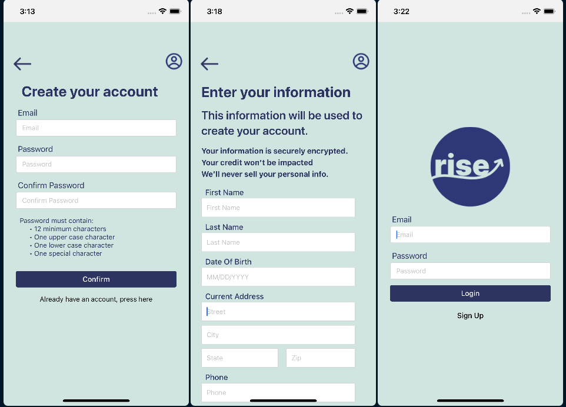
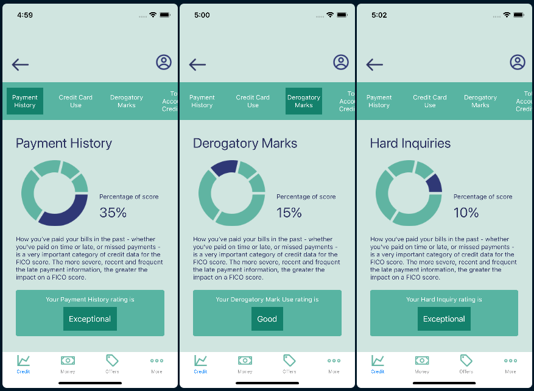

<!DOCTYPE html>
<html>
<head>
</head>
<body>
	<h1>Welcome to Rise!</h1> 
  <h3>This mobile application was developed during a hackathon focused on financial literacy to address the challenge of accessibility and ease of use.</h3>
	<h4 style="text-align: center;">"Elevating Credit Literacy for All Ages"</h4> 
  
This project was made possible by a talented team of UX designers, Software developers, and data engineers who worked over a three day sprint to bring the product to life!

  
  <h2>Create a User</h2>
	

  <h2>Look deeper<h2>
	Technologies Used:</h1>
	<ul>
		<li>React Native</li>
		<li>JavaScript</li>
		<li>TailwindCSS</li>
		<li>Expo</li>
		<li>Supabase</li>
		<li>Figma</li>
	</ul>
	<h2>Check out the live demo of the app: <a href="https://www.figma.com/proto/Gztm2KyqMmRfGCSV6VEe0k/Sketch%2F-Mid-fi?type=design&node-id=267-173&t=lYrw4xcGOTkW2x5C-1&scaling=scale-down&page-id=6%3A128&starting-point-node-id=265%3A125&show-proto-sidebar=1&mode=design"</a>Rise</h2>
</body>
</html>