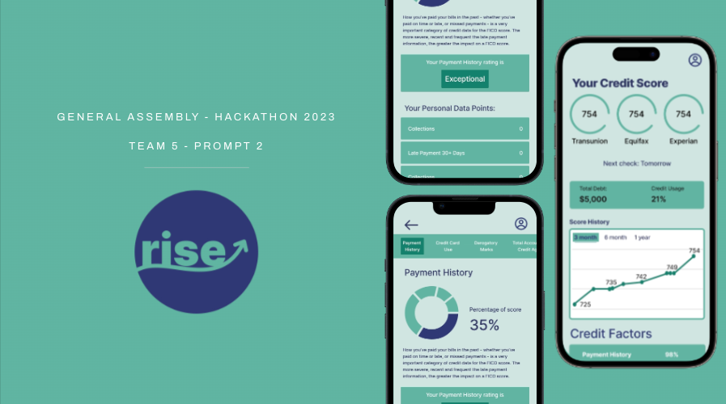
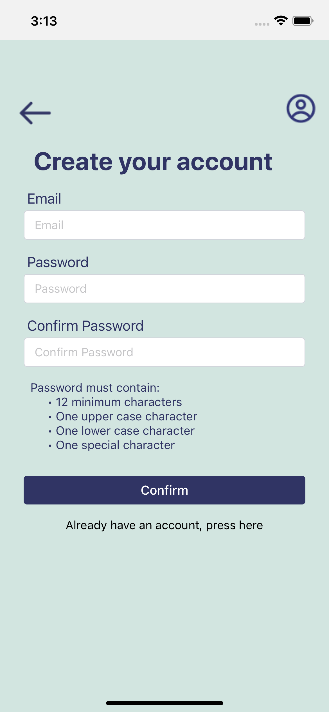
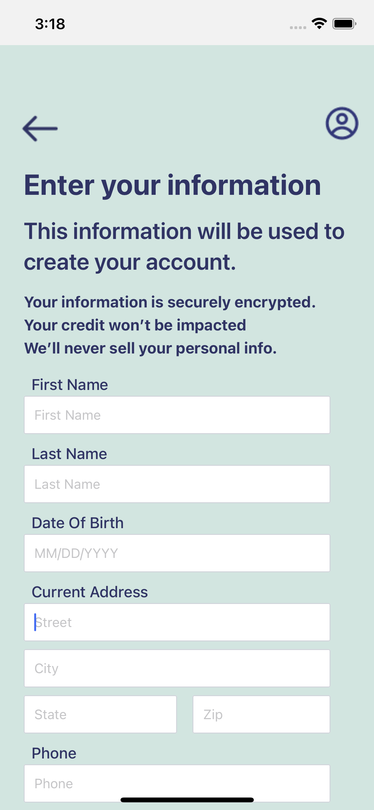
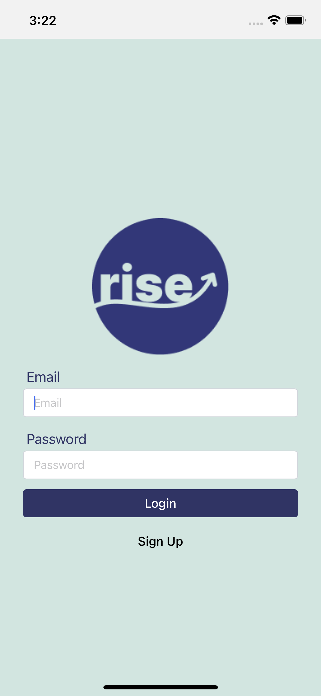
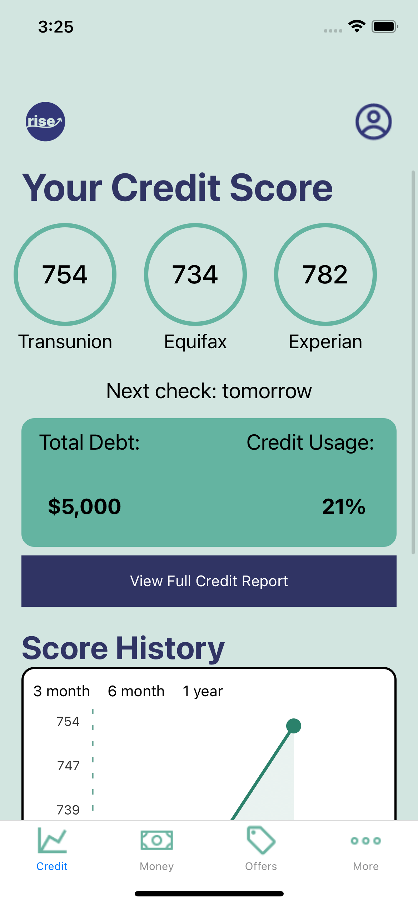
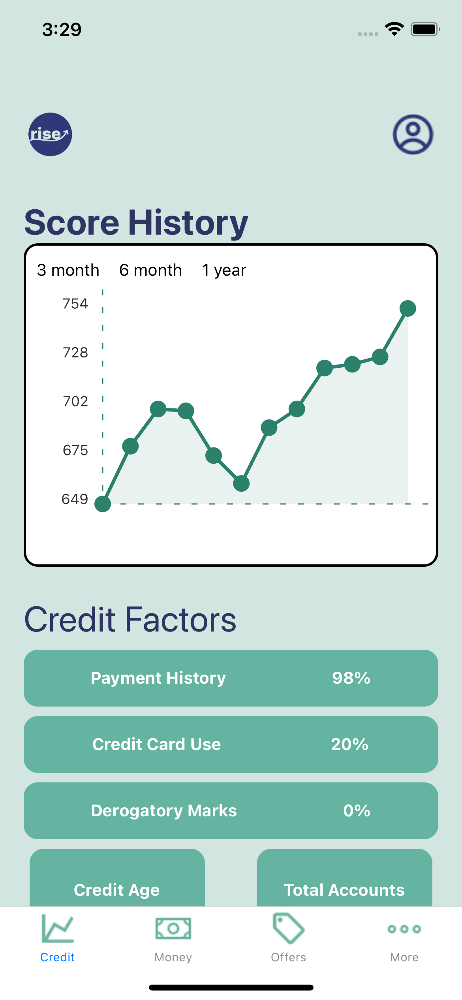
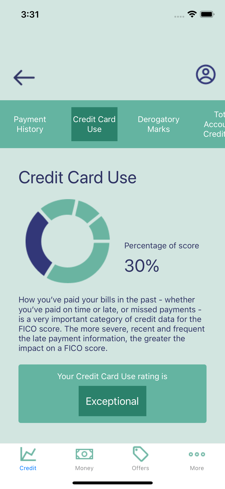
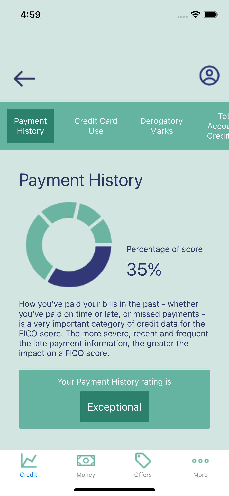
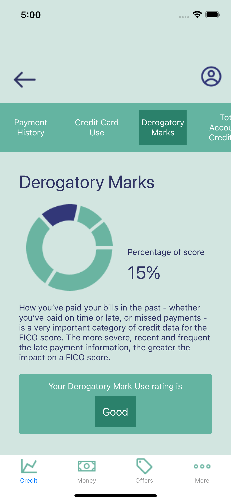
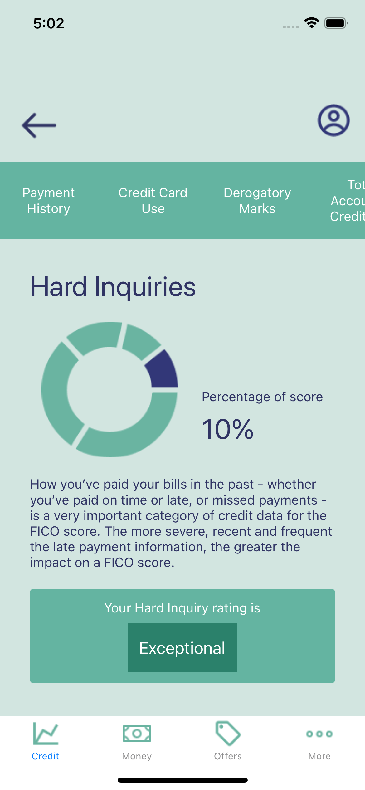

# Rise

## Introduction

Welcome to Rise! This mobile application was developed during a hackathon focused on financial literacy to address the challenge of accessibility and ease of use.

<h4 style="text-align: center;">"Elevating Credit Literacy for All Ages"</h4>

This project was made possible by a talented team of UX designers, Software developers, and data engineers who worked over a three day sprint to bring the product to life!

## Table of Contents

- [Introduction](#introduction)
- [Features](#features)
- [Demo](#demo)

## Features

### Create a User

  

    
  

  

    
  

  

    
  

### View your credit data

  

    
  

  

    
  

  

    
  

### Look deeper

  

    
  

  

    
  

  

    
  

### Technologies Used:
<ul>
    <li>React Native</li>
    <li>JavaScript</li>
    <li>TailwindCSS</li>
    <li>Expo</li>
    <li>Supabase</li>
    <li>Figma</li>
</ul>

## Demo

Check out the live demo of the app: [Rise](https://www.figma.com/proto/Gztm2KyqMmRfGCSV6VEe0k/Sketch%2F-Mid-fi?type=design&node-id=267-173&t=lYrw4xcGOTkW2x5C-1&scaling=scale-down&page-id=6%3A128&starting-point-node-id=265%3A125&show-proto-sidebar=1&mode=design)
